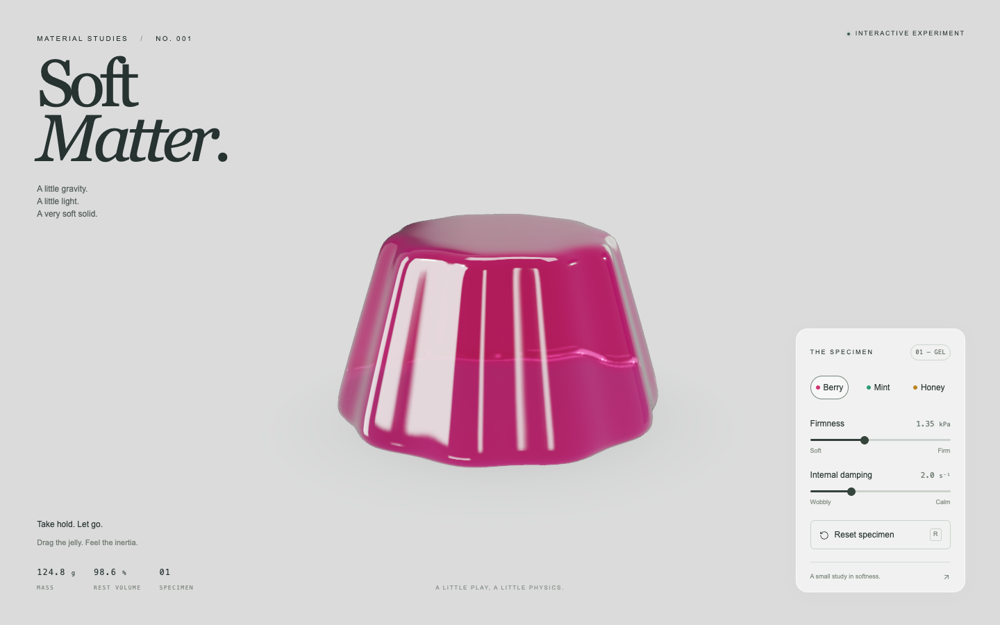

# Soft Matter · Jelly Lab

[简体中文](README.md) ｜ **English**

An interactive Three.js soft-body jelly experiment with a rounded pudding silhouette: a smaller flat top, gently fluted sides, and a broad rounded base. The page focuses on material, deformation, and tactile interaction without surrounding video or social UI.

## Live demo

**[Open the interactive Jelly Lab](https://54singa.github.io/soft-matter-jelly-lab/)**

[](https://54singa.github.io/soft-matter-jelly-lab/)

## Interaction

- Drag any visible point on the jelly with a mouse or finger.
- Release it to let elasticity and inertia continue the motion.
- Choose Berry, Mint, or Honey.
- Adjust firmness and internal damping independently.
- Use Reset or press `R` to restore the shape while retaining the material settings.
- The sliders support arrow keys, `Home`, and `End`.

## Run locally

Requires Node.js 22.13 or newer.

```sh
npm install
npm run dev -- --port 4399
```

Open the address printed in the terminal. To create a static production build:

```sh
npm run build
```

The generated site is in `dist/client/` and can be served by any static HTTP server. WebGPU requires localhost or HTTPS. The renderer automatically falls back to WebGL2 when needed.

## Implementation

`lib/soft-body.ts` contains a CPU XPBD soft-body solver with 343 particles, 1,296 tetrahedral volume constraints, elastic edge constraints, gravity, floor friction, and velocity damping. A fixed 120 Hz solver drives a finer smooth surface through interpolation. Raycast barycentric coordinates map the precise grab point to simulation particles, creating local stretch instead of scaling the entire object.

`lib/jelly.ts` contains the Three.js WebGPURenderer scene. Transmissive physical node materials, double-sided surfaces, clearcoat, absorption, an approximate thickness field, refracted studio lighting, updated normals, and a dynamic soft contact shadow create the wet optical appearance. The scene prefers WebGPU and includes a WebGL2 fallback.

`app/page.tsx` contains the controls and an optional, feature-detected WebMCP `configure_jelly` tool. The project has no server-side data storage or external runtime asset dependency.

## Validation

Browser pointer drags were tested on the front, top, and sides of the surface with both WebGPU and WebGL2 rendering. Grabs produce local deformation, and motion continues after release before gradually decaying. Color controls, keyboard slider controls, reset behavior, and material softness and damping limits were also checked.
